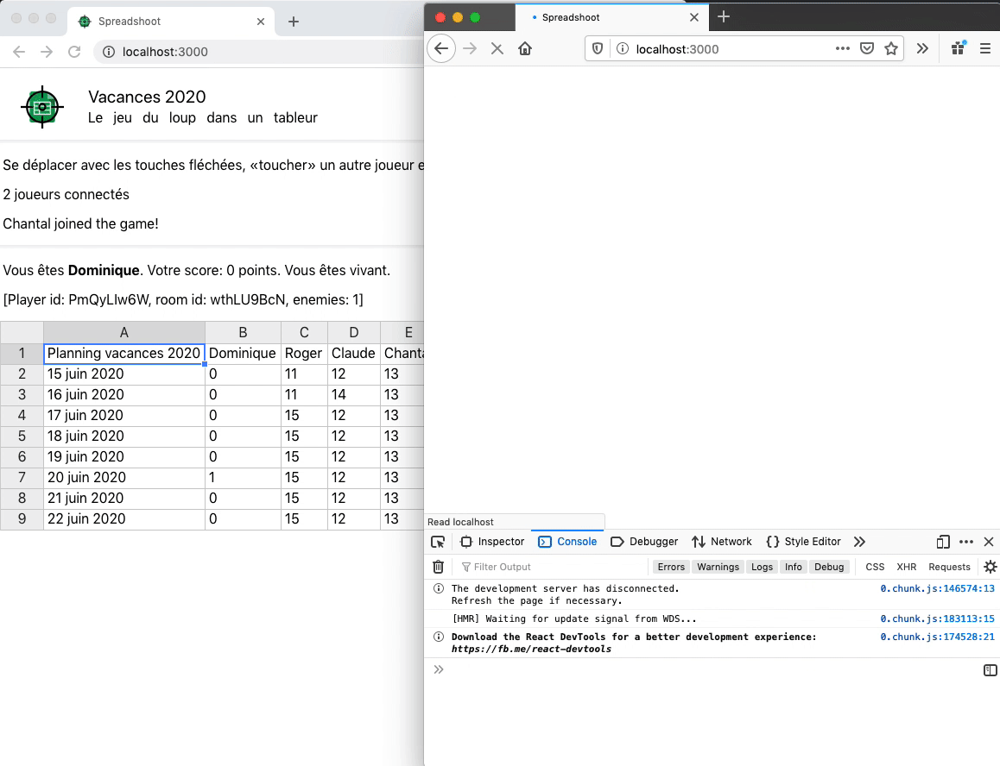

## Spreadshoot

2020\. Time to fight for the Holiday Planning!

A silly minigame to quickly practice using Multiplayer Game Server [Colyseus](https://github.com/colyseus/). Demo: [dogfight.tcch.ch/spreadshoot/](http://dogfight.tcch.ch/spreadshoot/)

Lots of bugs client-side (enemies gets hidden when you move) and server-side (no proper cleaning of disconnected players).

Built using React, [Handsontable](https://github.com/handsontable/handsontable) for the spreadsheet stuff, [i18next](https://github.com/i18next/i18next) for translation.

### Icon sources

Target: CC-BY SVGrepo https://www.svgrepo.com/svg/127638/target

Google Spreadsheet icon: no-attribution https://www.pngguru.com/free-transparent-background-png-clipart-gbehd
